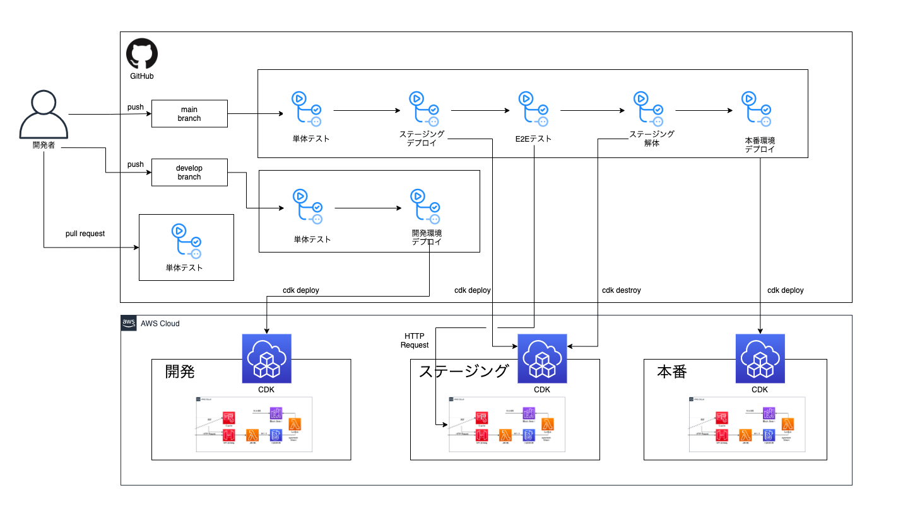

[](LICENSE)


# TODO リスト用 REST API
TODOリストを管理するWebやモバイルアプリケーションを想定したバックエンド用のREST API

## アーキテクチャ

## 環境
- AWS CDK 1.114.0 
- OS: Mac Big Sur 11.1
- nodejs v14.15.0

## 前提条件
1. 以下がインストール済みであること
    ```bash
    # npm
    $ npm --version
    7.20.0

    # aws-cli
    $ aws --version
    aws-cli/2.0.17 Python/3.7.3 Linux/5.10.25-linuxkit botocore/2.0.0dev21
    ```
2. AWSのクレデンシャルを設定済みであること
    ```bash
    $ aws configure
    AWS Access Key ID [****************ABCD]: 
    AWS Secret Access Key [****************EFGH]: 
    Default region name [ap-northeast-1]: 
    Default output format [json]: 
    ```
## 環境構築
1. npm依存パッケージをインストール
    ```bash
    $ npm install
    ```

4. AWS CDKのブートストラップ
    ```bash
    # 初めてCDKを使用する場合のみ以下を実行
    $ npm run cdk:bootstrap target=dev
    ```
## ドキュメント
- [要件整理](./docs/要件整理.md)
- [DB設計](./docs/Dynamodb設計.md)
- [API仕様書](https://joe-king-sh.github.io/todo-rest-api/api/)(API実行可能)
## ビルド
```bash
$ npm run build

# CDKからCloudFormation生成
$ npm run cdk:synth target=dev
```
## テスト
```bash
# 単体テスト
$ npm run test:unit
# E2Eテスト
$ npm run test:e2e target=(dev or stg or prod)
```
※ E2Eテストを実行するためには、後述のcdk:deployを実行している必要があります

## デプロイ
- 手動デプロイ
    ```bash
    # 開発環境
    $ npm run cdk:deploy target=dev
    # ステージング環境
    $ npm run cdk:deploy target=stg
    # 本番環境
    $ npm run cdk:deploy target=prod
    ```

- 継続的デプロイ

    ※ フォークしてCICDを実行する場合、GithubのSecretsに以下の設定が必要
    - AWS_ACCESS_KEY
    - AWS_SECRET_ACCESS_KEY

## その他
```bash
# swagger.ymlからAPI仕様書の作成
$ npm run docs:api

```